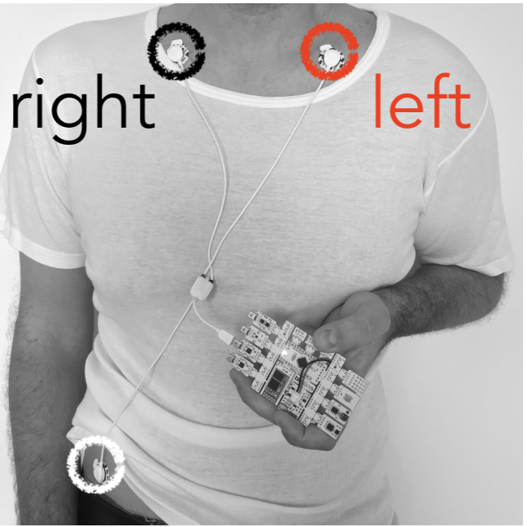

# Cardiac coherence

In this demo, we acquire heart signal using ECG sensor, we detect heart beats, estimate HRV in realtime and then HRV spectrum. This allows us to compute "coherence" biomarkers, that is the ratio between low frequency and high frequency. The feedback is a circle which radius depends on heart rate and color depends on coherence level.

## Setting up

### With artificial or recorded data (no device)

The default configuration uses artificial data (sinusoidal waves). You can also try pre-recorded data by commenting out the `sinus.yaml` graph in `main.yaml` and uncommenting `replay.yaml`.

### Using a BITalino device

You need to plug the ECG at input A1 of your device and positions the electrodes as follows:



⚠️ If you revert the IN+ (red) and IN- (black) electrodes, the ECG QRS will be inverted and the cardiac peaks won't be estimated correctly.

## Demo 

```bash
$ timeflux -d coherence/main.yaml
```

Then, open <http://localhost:8000/coherence/>. 


Feedback color scale: 

-  no good 
-  still not there 
-  try to relax
-  calmer
-  getting closer
-  almost there
-  good
-  great
-  coherence master
-  super-human
