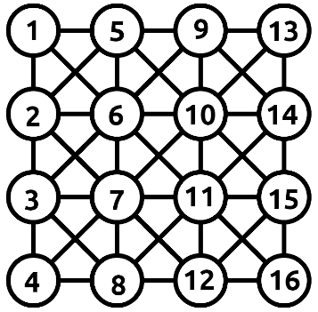

## Events sent to stream `events`

| Label        | Data                                                                                    |
| ------------ | --------------------------------------------------------------------------------------- |
| `calibrated` | `null`                                                                                  |
| `start`      | `null`                                                                                  |
| `end`        | `null`                                                                                  |
| `suspend`    | `null`                                                                                  |
| `running`    | `null`                                                                                  |
| `grid`       | `{"rows": <number>, "columns": <number>, "target": <number id>, "cursor": <number id>}` |
| `step`       | `{"angle": <number>, "closer": <boolean>, "cursor": <number id>, "win": <bool>}`        |

## `Cells IDs` on the grid

