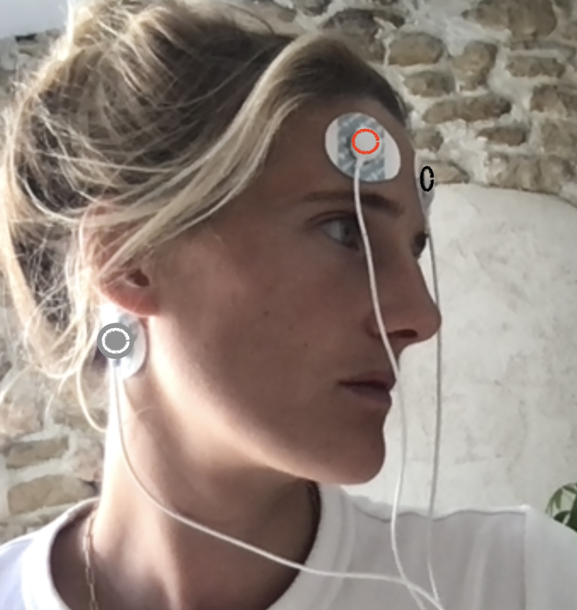

# Frequency Bands (EEG) 
This demonstrates how one could implement a simple neurofeedback application.

## Sensor montage
### Using Bitalino
You need to plug the EEG at inpuut A1 of Bitalino and place the electrode as follow: 

 
 

## Demo 

Run the app:

```
$ timeflux neurofeedback/bands/main.yaml -d 
```

Open a browser, and visualize:

- [The raw EEG data](http://localhost:8000/monitor/)
- [The relative and absolute frequency bands for the `Fpz` channel](http://localhost:8000/bands/)


Image credits: https://thenounproject.com, Nick Taras.
## With fake or replayed data (no device)
You just need to comment the bitalino graph in main.yaml and instead uncomment the sinus graph (for sinusoidal input) or the replay graph (for replayed data).


