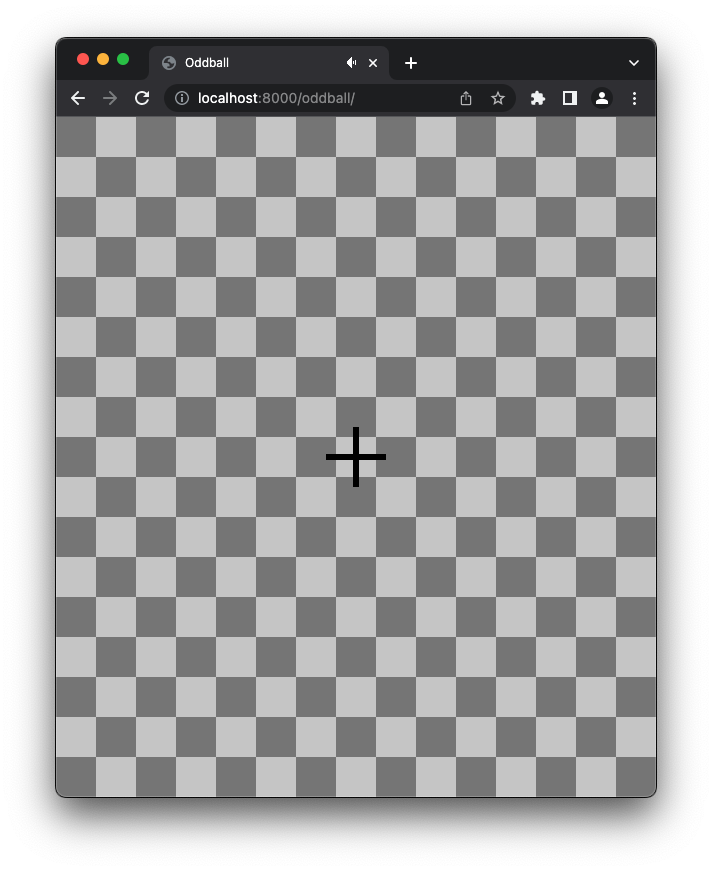

# Oddball protocol

This is a fully-configurable Oddball protocol, with visual, auditory and haptic support.



## Configuration

Edit `main.yaml` to suit your needs. All configuration options can be found [here](../../../tree/main/oddball/oddball/www/assets/js/app.js).

## Running the application

Launch:

```
timeflux -d oddball/main.yaml
```

The whole GUI runs in your web browser. You can monitor the EEG signal [here](http://localhost:8000/monitor) and access the main application [here](http://localhost:8000/oddball).

The raw EEG data is recorded in the `data` folder.

