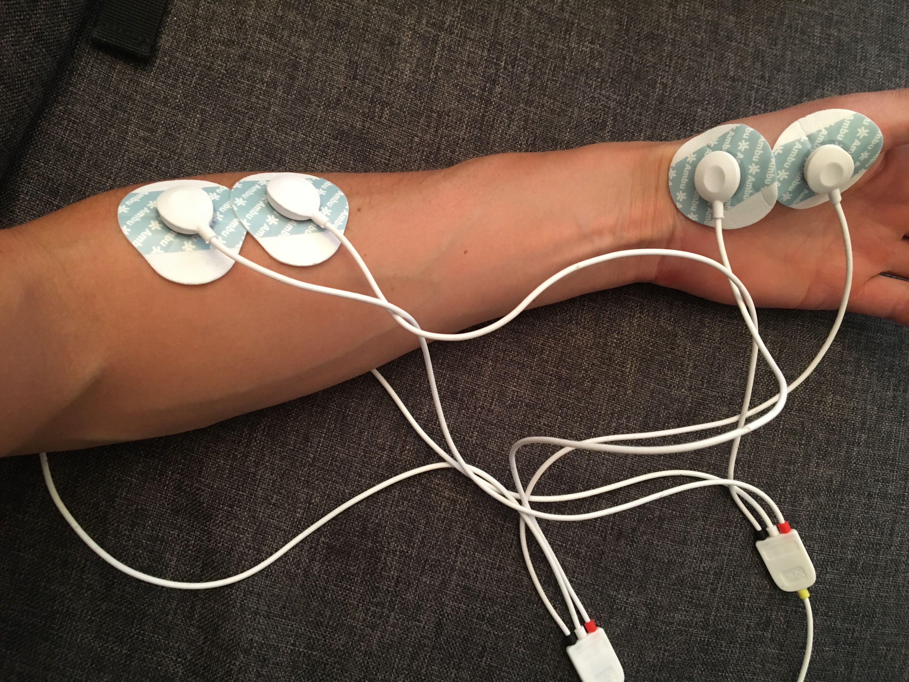
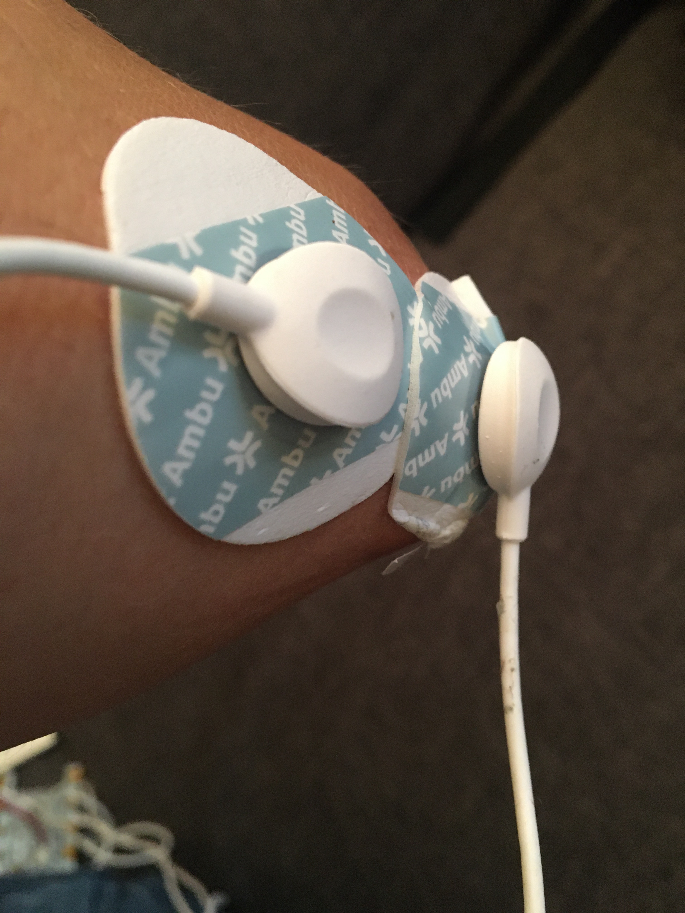

# Rock, paper, scissors

In this demo, we acquire muscle signals using two EMG sensors.
First, we detect muscles activation and give a feedback using a gauge which level depends on activation strength.
Then, we classify the 3 gestures of a roshambo game (rock, paper, scissors) and rest using a KNN classifier.

## Setting up

### With random or recorded data (no device)

The default configuration uses random data. You can also try pre-recorded data by commenting out the `random.yaml` graph in `main.yaml` and uncomment `replay.yaml`.

### Using a BITalino device

You need to plug the EMG at inputs A1 and A2 of your device and positions the electrodes as follows:

 
 
 

Position the ground sensors (white) on your elbows (or anywhere without muscle activity).

## Running

Launch the app:

```
$ timeflux -d roshambo/main.yaml
```

Then, open <http://localhost:8000/roshambo/>.
