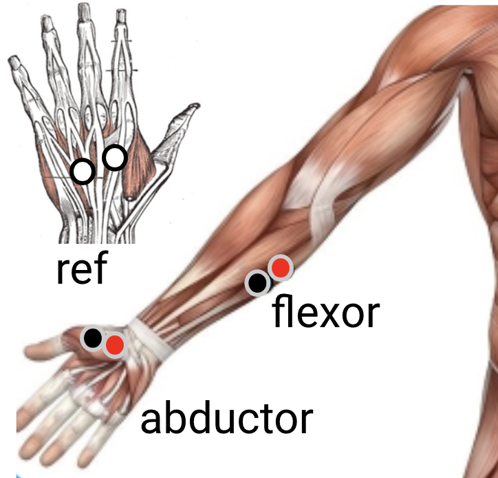
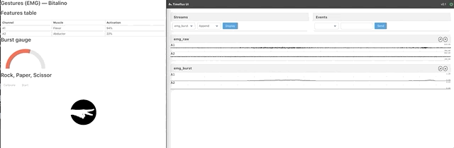

# Muscles (EMG) 
In this demo, we acquire muscles signal using two EMG sensors. 
First, we detect muscles activation and give a feedback using a gauge which level depends on activation strengh. 
Then, we classify the 3 gestures of roshambo game (scissor, paper, rock) and rest using a KNN classifier. 


## Sensor montage
You need to plug the EMG at inputs A1 and A2 of Bitalino and place the electrode as follow: 

 
 
 

Place the mass (white sensors) on your elbow (or anywhere without muscle activity).

## Demo 

```bash
	timeflux -d roshambo/main.yaml
```

Then, open <http://localhost:8000/roshambo/>. 




## With fake or replayed data (no device)
You just need to comment the bitalino graph in main.yaml and instead uncomment the sinus graph (for sinusoidal input) or the replay graph (for replayed data).