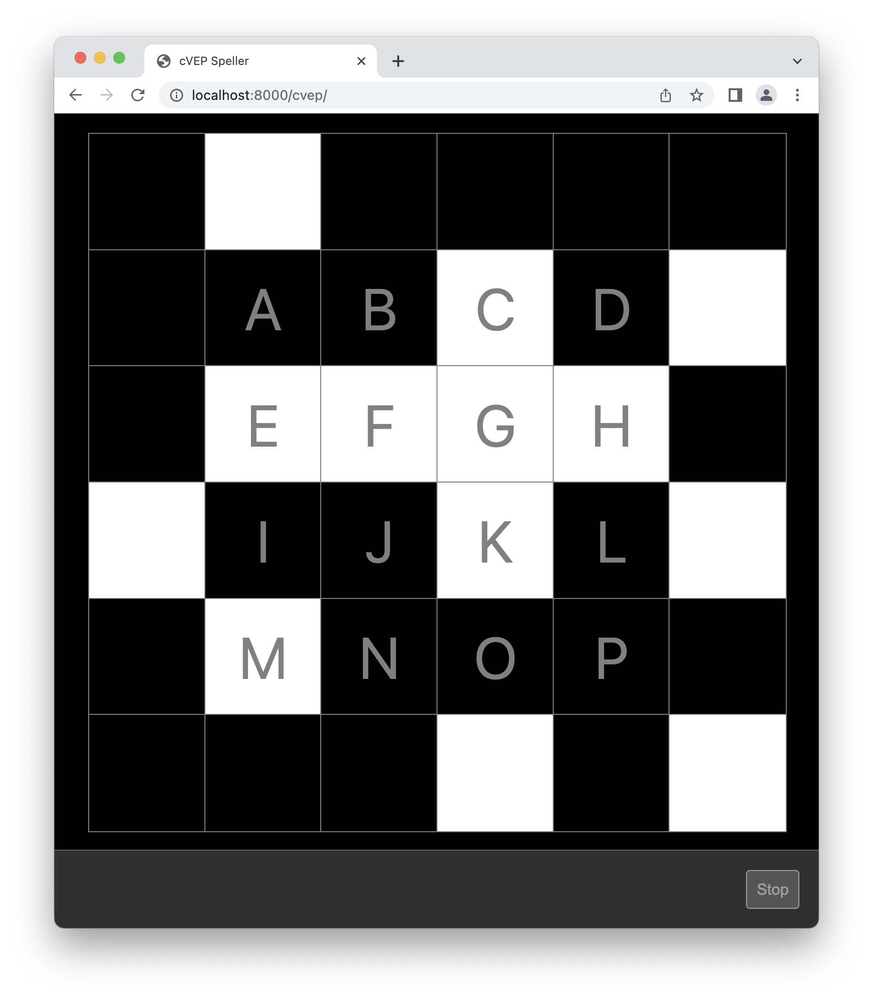
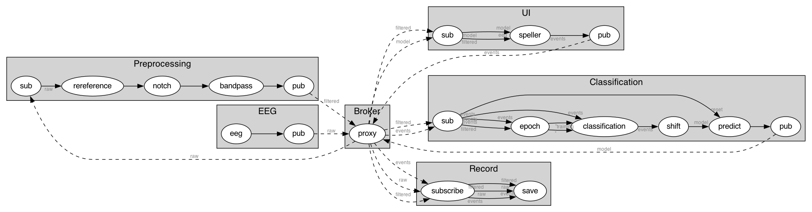

# CVEP Speller



## Installation

First, [install Timeflux](https://pypi.org/project/timeflux/) in a dedicated environment.

```
$ conda create --name timeflux python=3.10 pytables
$ conda activate timeflux
$ pip install timeflux
```

Then, install the dependencies for this application:

```
$ pip install -r requirements.txt
```

## Configuration

The application can be configured using environment variables. The following settings are available:

- `PATTERN`: A sequence of `1`s and `0`s that will be used for the the CVEP sequence.
- `NBITS`: If `PATTERN` is not provided, the system will automatically generate a suitable m-sequence. The length of the resulting sequence will be `(2**NBITS) - 1`.
- `STEP`: The number of bits to shift for each new target. The maximum number of targets is therefore `PATTERN_LENGTH / STEP`.
- `RATE`: The screen refresh rate. Used to calculate the `EPOCH_LENGTH`. Default: `60`.
- `SEED`: If set, allows reproducible results. The seed is used during the m-sequence generation.
- `CYCLES`: During the calibration phase, how many times the pattern is completely rotated per target.
- `TARGETS`: Number or list of targets to activate during calibration.
- `DEVICE`: Name of the acquisition device. Expects to find a graph with the same name. Currently supported: `lsl`, `hackeeg`, `random` (a virtual device that generates synthetic data).
- `RECORD`: Whether to record the EEG data and events.

Example environment files can be found in the `conf` folder.

Advanced options can be set in the `.yaml` files.

## Running the demo

Make sure you have a suitable environment file. Assuming your configuration resides in `conf/myconf.cnf`:

```
$ cd speller
$ timeflux -d -E conf/myconf.cnf main.yaml
```

The whole GUI runs in your web browser. You can monitor the EEG signal [here](http://localhost:8000/monitor) and access the main application [here](http://localhost:8000/cvep). The speller early-stopping settings can be configured dynamically by pressing the `s` key.

Raw and filtered EEG data, as well as events from the classifier and the GUI, are recorded in the `data` folder. Logs can be found in the `log` folder.

## Application schema

This is a graphical representation of what can be found in the `.yaml` files.



## Paper

Work in progress!
